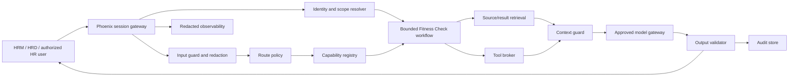

# HR Fitness Check Agent/RAG alignment plan

Version: 0.3
Status: Draft implementation plan
Last updated: 2026-08-10

## Planning thesis

Keep HR Fitness Check as a governed quarterly Standard Work assessment. Do not convert it into a general agent. Deterministic catalog, source, rule, and result services remain authoritative; retrieval supplies governed context; AI may produce a supervised narrative only after those controls pass.

## Current state

| Layer | Current state | Next gate |
| --- | --- | --- |
| Product definition | Strong draft PRD and a 33-row July 29 working disposition; catalog approval and five-row reconciliation remain open. | Approve stable IDs, denominator, named accountable owners, and implementation modes. |
| Architecture contracts | Draft source, object, retrieval, capability, tool, eval, audit, and rollout documents exist. | Remove drift and convert approved fields into machine-readable contracts. |
| Data/source implementation | Metadata discovery and SQL seeds exist; no approved ingestion or scoring pipeline. | Approve a narrow pilot source set and deterministic rules. |
| Agent/RAG runtime | Not implemented. | Build identity/scope, route, broker, context, model, validation, trace, and audit controls. |
| User experience | Read-only `mvp/` cockpit uses synthetic/discovery data and contract-backed local APIs; `poc/` is an earlier static reference. | Preserve the synthetic boundary and bind production views only after approved identity, sources, rules, and governance controls exist. |

## Target architecture

## Architecture decisions to preserve

These remain proposed until owners approve the corresponding ADRs.

| Decision | Recommended posture |
| --- | --- |
| Source of truth | Reviewed repository contracts are canonical; approved changes become GitHub authority after commit/push; workbook is discovery evidence; Confluence is downstream. |
| Topology | One bounded workflow, not multiple agents. |
| Retrieval | Metadata/keyword and deterministic structured lookups in MVP; no vector or graph dependency. |
| Scoring | Deterministic rule engine before any model call. |
| Autonomy | L0-L3 default; L4 preview only for manual input/publishing; L5 disabled; L6 out of scope. |
| Context | Approved canonical objects and result facts only; access filtered and minimized before model context. |
| Memory | Request/session state only unless a separate retention decision approves more. |
| Recommendation sources | VOC/TM Experience roadmap material may support recommendations only after artifact-level approval; it is not scoring input. |

## Exact artifact plan

### Update now

| File | Change |
| --- | --- |
| `docs/Architecture-Alignment-Assessment.md` | Maintain the evidence-backed categorized assessment and exact gaps. |
| `docs/Agent-RAG-Alignment-Plan.md` | Maintain the sequenced build and file manifest. |
| `docs/Capability-Registry-and-Route-Policy.md` | Keep HR Fitness Check capabilities only; complete per-capability contracts after owner/model decisions. |
| `docs/Tool-Action-Governance.md` | Keep HR Fitness Check tools/action classes only; keep writes disabled. |
| `docs/Evaluation-Observability-Audit.md` | Reconcile cases to the July 29 33-row working catalog and later link executable eval results. |
| `docs/Rollout-and-Operating-Model.md` | Track gate evidence, owners, and runbook status. |
| `knowledge-base/source-registry.md` | Complete row-level governance fields for the approved pilot sources. |
| `knowledge-base/canonical-knowledge-objects.md` | Use the current draft ID namespace only as a temporary reference and block it from production joins. |
| `knowledge-base/ingestion-backlog.md` | Preserve the old 27-row and June 30 draft-ID crosswalks as prohibited-for-joins history, then rebuild around the 33-row July 29 working catalog after stable-ID approval. |
| `knowledge-base/retrieval-context-assembly.md` | Reconcile disposition behavior and bind it to validated schemas later. |
| `mvp/` and `docs/mvp/` | Preserve the read-only synthetic review contract and keep production promotion gates explicit. |
| `poc/index.html`, `poc/styles.css`, `poc/app.js`, `poc/README.md` | Retain as an archived static reference; do not treat it as the current review build. |

### Create after the named decision is approved

| Artifact | Exact path | Prerequisite |
| --- | --- | --- |
| Approved catalog | `contracts/standard-work-catalog.json` | Stable IDs, owners, disposition, and implementation modes. |
| Enforceable source registry | `contracts/source-registry.json` | Source owner, access, classification, freshness, retention, citation, and approval. |
| Runtime registries | `contracts/capability-registry.json`, `contracts/tool-registry.json`, `contracts/action-classes.json` | Runtime owners, scopes, tools, approvals, feature flags, and rollout state. |
| Model/prompt registries | `contracts/model-profiles.json`, `contracts/prompt-packages.json` | Provider/data-handling and prompt approval. |
| Control schemas | `schemas/hrfc-control-contracts.schema.json` | Field contracts approved. |
| ADRs | `architecture/decisions/ADR-001-source-of-truth.md` through `ADR-006-retrieval-posture.md` | Product/architecture review. |
| Data/access policies | `docs/Access-and-Data-Handling.md`, `docs/Memory-State-and-Retention.md`, `docs/Ingestion-and-Versioning.md` | Governance, security, legal, and source-owner decisions. |
| Phoenix design | `docs/Phoenix-Runtime-Design.md` | Platform component and identity mapping. |
| Evals | `evals/hrfc-gold-cases.jsonl`, `evals/hrfc-pilot-scorecard.md` | Stable capabilities, sources, schemas, and thresholds. |
| Runbooks | `runbooks/source-stale.md`, `source-blocked.md`, `unauthorized-retrieval.md`, `prompt-injection.md`, `tool-outage.md`, `bad-answer.md`, `manual-input-correction.md`, `rollback.md` | Operational ownership and alert/incident integration. |

## Phased implementation

### Phase 0: Contract cleanup

1. Approve stable item IDs; publish the legacy `V1-###` to current draft `A-###` crosswalk.
2. Remove cross-product capabilities/tools from the HRFC registries; relocate MAIA research after owner confirmation.
3. Complete row-level source-registry fields for a narrow pilot source set.
4. Approve missing-value, denominator, Quality Index, and implementation-mode rules.

Exit evidence: approved catalog, source candidates, decision records, and no ambiguous identifiers.

### Phase 1: Deterministic assessment core

1. Implement approved source connectors or views with manifests and active-version semantics.
2. Implement catalog, source mapping, rule, result, and rollup schemas.
3. Implement scoring outside the model.
4. Reconcile results against SME-approved examples and recast the baseline only after the denominator decision.

Exit evidence: exact scoring fixtures pass; missing/manual/stale/unmapped cases never receive fabricated ratings.

### Phase 2: Governed read-only cockpit

1. Implement identity and site/rollup scope resolution.
2. Implement registered routes, read-only tools, feature flags, access filters, and audit envelopes.
3. Bind the cockpit to contract-backed readiness/results instead of hard-coded demo data.
4. Verify empty, partial, stale, blocked, unauthorized, and conflict states.

Exit evidence: read-only alpha evals, access-denial tests, redacted traces, and rollback switch pass.

### Phase 3: Supervised RAG and narrative

1. Assemble citation-ready context from approved results, canonical rules, source metadata, and caveats.
2. Use one approved model profile and one versioned prompt package.
3. Validate schema, citations, unsupported claims, privacy, caveats, and action-boundary language.
4. Capture review feedback as product evidence, not training data.

Exit evidence: narrative gold cases and human review thresholds pass with zero critical unsupported claims.

### Phase 4: Preview and supervised actions

1. Implement exact manual-input and publishing previews.
2. Add human approval records, action-class governance, execution receipts, and correction/rollback workflows.
3. Promote a single L5 action only after authorization, rollback, incident, and eval evidence passes.

Exit evidence: explicit approval and rollback tests pass. L6 remains out of scope.

## Pilot gates

- Every enabled capability has an owner, feature flag, source/tool/model scope, output schema, eval gate, rollout state, and rollback.
- Every enabled source has an approved owner, steward, classification, audience, workflow, freshness, retention, redaction, citation, and active version.
- Deterministic scoring reconciles to approved examples.
- Unauthorized, stale, conflicting, injected, missing, manual, and unsafe-action cases fail as designed.
- Shared traces contain no raw sensitive payloads.
- Audit samples prove route, capability, source, tool, model, prompt, validation, approval, and feedback state.
- Support, review sampling, incident ownership, and rollback dry runs are complete.

## Explicit non-goals

- General-purpose HR chat.
- Multi-agent orchestration without a measured need.
- Autonomous source-system writes or employment decisions.
- Associate-level findings in shared UI, narrative, Confluence, traces, or eval exports.
- Vector search, GraphRAG, long-term memory, or curated cache in MVP without benchmark and governance approval.
